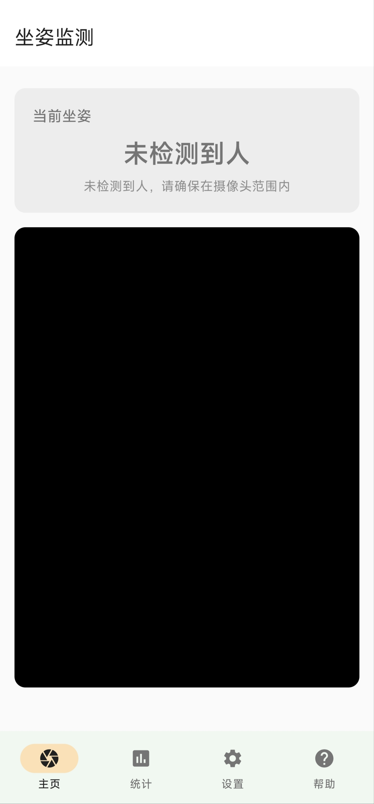
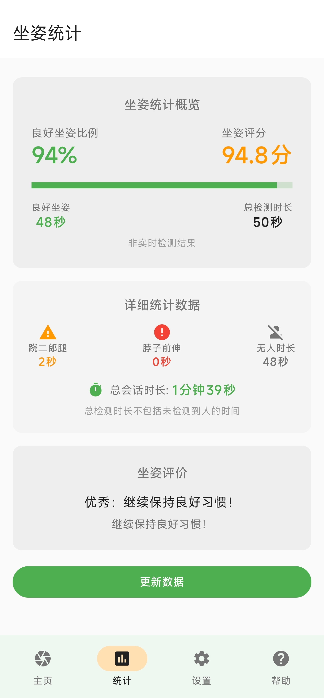
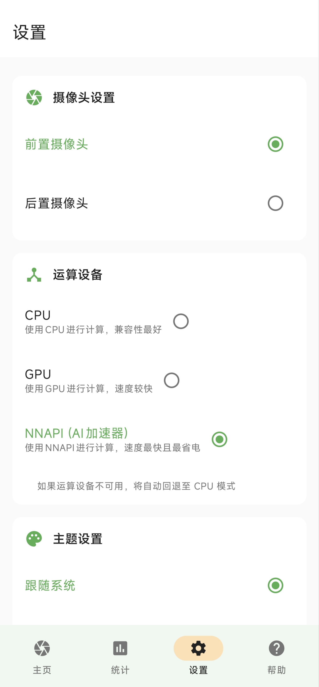
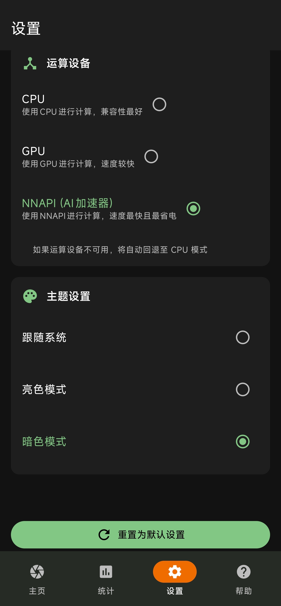
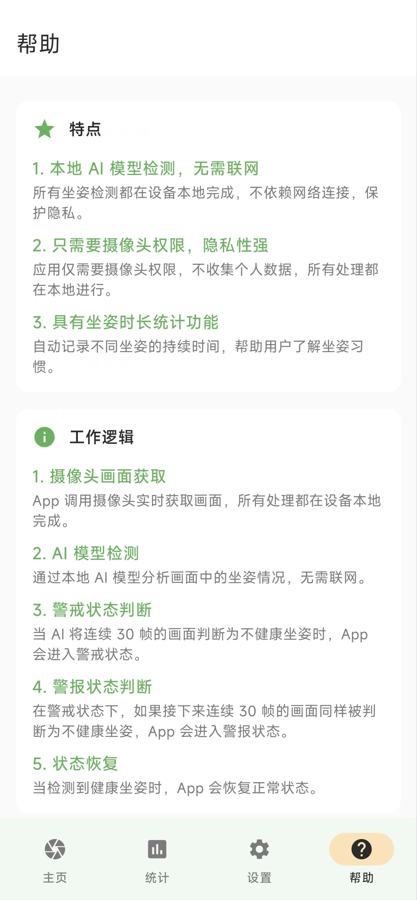

# 青松 - AI 坐姿检测

一款基于 Android 平台的 AI 坐姿检测应用。  
通过 AI 模型检测用户坐姿情况，并提供坐姿状态显示和坐姿数据统计。

## 背景

当今，长时间错误的坐姿已成为影响青少年健康的隐形杀手。  
**青松 (PineStyle)** 通过端侧 AI 技术，在保护隐私的前提下，为用户提供低功耗、高精度的实时坐姿检测。

## 特性

### 核心功能

- **摄像头预览**：实时显示摄像头画面
- **坐姿状态显示**：显示当前坐姿状态
- **数据统计**：记录检测数据并生成坐姿评价
- **个性化设置**：支持亮色/暗色模式自由切换

### 用户界面

- **四个主页面**：
    1. **主页**：显示摄像头画面和当前坐姿状态
    3. **统计页面**：展示坐姿检测数据和评价
    4. **设置页面**：配置应用偏好设置
    5. **帮助页面**：显示 App 的特点、工作逻辑、使用说明和版权信息
- **简洁设计**：采用 Material Design 3 设计语言
- **主题支持**：亮色/暗色/跟随系统主题

<table width="100%">
    <tr>
        <td width="20%" style="line-height:0;"></td>
        <td width="20%" style="line-height:0;"></td>
        <td width="20%" style="line-height:0;"></td>
        <td width="20%" style="line-height:0;"></td>
        <td width="20%" style="line-height:0;"></td>
    </tr>
</table>

## 设备

Android 10 以上的 arm64-v8a 设备即可。

## 开发

- 在终端中运行：`git clone https://github.com/fstyou/pine-style.git`
- 在 Android Studio 中打开本项目

## 许可证

本项目整体采用 **GPL-3.0** 协议开源。

## 致谢

本项目的 AI 部分基于以下开源项目改造：

- [PoseMon](https://github.com/linyiLYi/pose-monitor)
- [TensorFlow Examples](https://github.com/tensorflow/examples)

感谢各位程序工作者对开源社区的贡献。
